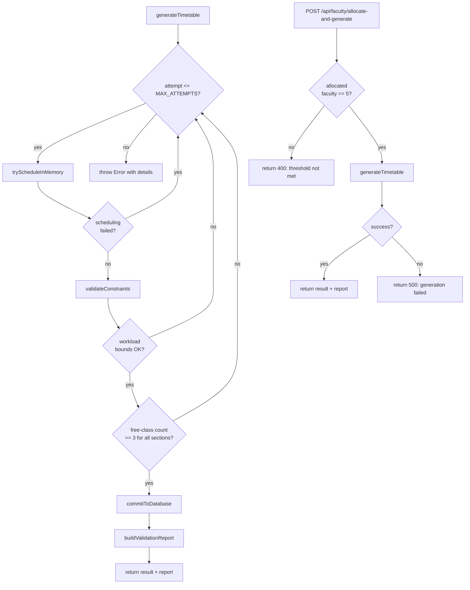

# Design Document

## Feature: Faculty Workload & Free-Class Balancing

---

## Overview

This feature modifies the in-memory scheduling engine (`backend/services/generator.js`) to enforce two categories of constraints:

1. **Faculty workload bounds** — each faculty member must be assigned between 15 and 18 teaching periods per week (inclusive).
2. **Free-class fairness** — free classes (Library, Sports, Counselling) must be distributed equally across all sections of the same year group, capped at 3 per section per week, and assigned only when a genuine availability conflict exists.

The core changes are within the generator's `tryScheduleInMemory` function and its surrounding validation logic. No new database tables are required. A validation report is produced on successful generation.

Additionally, a new backend service hook and API endpoint implement **Requirement 8**: when the number of faculty members allocated to subjects reaches exactly 5, the system automatically triggers faculty allocation and timetable generation without manual intervention.

---

## Architecture

The generator follows a **retry-loop architecture**: `generateTimetable` calls `tryScheduleInMemory` up to `MAX_ATTEMPTS` times. Each attempt is a pure in-memory scheduling pass. On success, `commitToDatabase` writes the result once.

The new constraints integrate into this existing pattern:

```
generateTimetable()
  └─ loop up to MAX_ATTEMPTS
       └─ tryScheduleInMemory(assignments, labRooms, sections)
            ├─ schedule free periods (priority 0)  ← MODIFIED (exactly 3)
            ├─ schedule labs        (priority 1)
            ├─ schedule projects    (priority 2)
            └─ schedule theory      (priority 3)
            └─ validateConstraints()               ← NEW
                 ├─ checkWorkloadBounds()
                 └─ checkFreeClassBalance()        ← checks == 3, not <= 3
  └─ commitToDatabase(entries)
  └─ buildValidationReport(entries)               ← NEW

POST /api/faculty/allocate-and-generate            ← NEW (Requirement 8)
  └─ checkAllocatedFacultyCount()
       └─ if count == 5 → generateTimetable()
```



---

## Components and Interfaces

### 1. `facultyWorkload` counter map

A plain object `{ [fId]: number }` maintained inside `tryScheduleInMemory`. Incremented every time a non-free-period teaching slot is marked. Checked before each assignment.

```js
// Initialised at the top of tryScheduleInMemory
const facultyWorkload = {}; // fId → period count

// Helper
function workloadOf(fId) { return facultyWorkload[fId] || 0; }
function canAssign(fId)  { return workloadOf(fId) < 18; }
function recordAssign(fId) { facultyWorkload[fId] = workloadOf(fId) + 1; }
```

### 2. `freeDayCount` → `freeCount` (renamed & extended)

The existing `freeDayCount` map (tracks free classes per section) is renamed to `freeCount` for clarity. The free-class assignment logic enforces an **exact target of 3** — sections must end up with exactly 3 free classes, no more and no fewer. The cap check prevents over-assignment during scheduling; the exact-3 check in `validateConstraints` rejects any attempt where a section finishes with fewer than 3.

```js
const freeCount = {}; // sId → free-class count this week
function freeOf(sId)      { return freeCount[sId] || 0; }
function canAddFree(sId)  { return freeOf(sId) < 3; }   // prevents exceeding 3
function recordFree(sId)  { freeCount[sId] = freeOf(sId) + 1; }
```

### 3. `isAvailabilityConflict(sId, d, p, subjectMappings)` — new helper

Returns `true` when every faculty member mapped to any subject for the given section is either busy in slot `(d, p)` or has reached the 18-period workload cap.

```js
function isAvailabilityConflict(sId, d, p, mappedFacultyIds) {
    return mappedFacultyIds.every(fId =>
        facultyBusy.has(fKey(fId, d, p)) || !canAssign(fId)
    );
}
```

### 4. `validateConstraints(entries, sections)` — new function

Called after a successful scheduling pass. Returns `{ ok: boolean, errors: string[] }`.

- Recomputes workload per faculty from `entries` (excludes free-period subjects).
- Checks every faculty is in [15, 18].
- Recomputes free-class count per section from `entries` (includes only free-period subjects).
- Checks every section has a free-class count of **exactly 3** (not just ≤ 3); any section with a count other than 3 is flagged.
- Checks all sections within each year group share the same count (balance check).
- Returns `{ ok: errors.length === 0, errors }`.

### 5. `buildValidationReport(entries, sections, allFaculty)` — new function

Called once after `commitToDatabase`. Returns a structured report object:

```js
{
  faculty: [
    { faculty_id, period_count, compliant: boolean }
  ],
  yearGroups: {
    2: { balanced: boolean, sections: [{ section_id, section_name, free_class_count }] },
    3: { balanced: boolean, sections: [{ section_id, section_name, free_class_count }] }
  }
}
```

This report is logged to console and returned as part of the API response.

---

### 6. Auto-trigger mechanism — `POST /api/faculty/allocate-and-generate`

**Requirement 8** introduces an automatic trigger: when exactly 5 faculty members have been allocated to subjects, the system fires timetable generation without manual intervention.

#### Service-level hook: `checkAndAutoGenerate(db)` — new function in `generator.js`

```js
/**
 * Counts faculty members that have at least one subject allocated in faculty_mapping.json.
 * If the count equals FACULTY_THRESHOLD (5), calls generateTimetable() automatically.
 * Returns { triggered: boolean, result? } 
 */
const FACULTY_THRESHOLD = 5;

async function checkAndAutoGenerate() {
    const allocated = await fetchAll(
        `SELECT COUNT(DISTINCT faculty_id) AS cnt FROM Subjects WHERE faculty_id IS NOT NULL`
    );
    const count = allocated[0]?.cnt ?? 0;
    if (count !== FACULTY_THRESHOLD) {
        return { triggered: false, allocatedCount: count };
    }
    const result = await generateTimetable();
    return { triggered: true, result };
}
```

#### Backend route: `POST /api/timetable/auto-generate`

Added to `backend/routes/timetable.js` (admin-only, same auth middleware as `/generate`):

```js
router.post('/auto-generate', async (req, res) => {
    try {
        const outcome = await generatorService.checkAndAutoGenerate();
        if (!outcome.triggered) {
            return res.status(400).json({
                error: 'Auto-generation threshold not met',
                allocatedCount: outcome.allocatedCount,
                required: 5
            });
        }
        res.json(outcome.result);
    } catch (error) {
        console.error('Auto-generate error:', error);
        res.status(500).json({ error: 'Auto-generation failed', details: error.message });
    }
});
```

#### Trigger flow

```
Client / admin action (5th faculty allocated)
  → POST /api/timetable/auto-generate
       → checkAndAutoGenerate()
            → COUNT(DISTINCT faculty_id) FROM Subjects WHERE faculty_id IS NOT NULL
            → if count == 5: generateTimetable()
            → if count != 5: return 400
```

The route does **not** retry on generation failure — per Requirement 8.3, a single failure returns a descriptive error immediately.

---

## Data Models

No new database tables. All new state is in-memory within a single scheduling attempt.

### In-memory state additions (inside `tryScheduleInMemory`)

| Variable | Type | Purpose |
|---|---|---|
| `facultyWorkload` | `{ [fId]: number }` | Running teaching-period count per faculty |
| `freeCount` | `{ [sId]: number }` | Running free-class count per section (target: exactly 3) |
| `sectionMappedFaculty` | `{ [sId]: Set<fId> }` | All faculty IDs mapped to any subject for a section |

### Module-level constants

| Constant | Value | Purpose |
|---|---|---|
| `FACULTY_THRESHOLD` | `5` | Number of allocated faculty that triggers auto-generation |

### `sectionMappedFaculty` construction

Built once before the scheduling loop from `baseAssignments`:

```js
const sectionMappedFaculty = {};
for (const { section, fId } of baseAssignments) {
    const sId = section.section_id;
    if (!sectionMappedFaculty[sId]) sectionMappedFaculty[sId] = new Set();
    sectionMappedFaculty[sId].add(fId);
}
```

### Validation report shape

```ts
interface ValidationReport {
  faculty: Array<{
    faculty_id: number;
    period_count: number;
    compliant: boolean;       // 15 <= period_count <= 18
  }>;
  yearGroups: {
    [year: number]: {
      balanced: boolean;      // all sections have equal free_class_count
      sections: Array<{
        section_id: number;
        section_name: string;
        free_class_count: number;
      }>;
    };
  };
}
```

---

## Correctness Properties

*A property is a characteristic or behavior that should hold true across all valid executions of a system — essentially, a formal statement about what the system should do. Properties serve as the bridge between human-readable specifications and machine-verifiable correctness guarantees.*

### Property 1: Workload count accuracy

*For any* set of timetable entries and any faculty member, the computed workload count should equal the number of entries where `faculty_id` matches and the subject is not a free-period subject (Library, Sports, Counselling).

**Validates: Requirements 1.1, 7.1**

---

### Property 2: Workload compliance classification

*For any* faculty workload count `n`, the compliance flag in the validation report should be `true` if and only if `15 <= n <= 18`.

**Validates: Requirements 1.2, 2.2, 7.3**

---

### Property 3: Workload cap enforcement

*For any* faculty member whose current workload count equals 18, the scheduler should reject any attempt to assign an additional teaching period to that faculty member.

**Validates: Requirements 2.1, 2.2**

---

### Property 4: Free-class count accuracy

*For any* set of timetable entries and any section, the computed free-class count should equal the number of entries where `section_id` matches and the subject is one of the free-period subjects (Library, Sports, Counselling).

**Validates: Requirements 3.1, 4.1, 7.2**

---

### Property 5: Free-class exact-target enforcement

*For any* section, the scheduler should reject any attempt where the section's final free-class count is not exactly 3 — both over-assignment (count > 3) and under-assignment (count < 3) must cause the attempt to be retried.

**Validates: Requirements 5.2, 5.3, 5.4, 3.3, 4.3**

---

### Property 6: Year-group balance classification

*For any* year group (set of sections with their free-class counts), the `balanced` flag in the validation report should be `true` if and only if all sections in the group share the same free-class count.

**Validates: Requirements 3.2, 4.2, 7.4**

---

### Property 7: Free classes only on genuine conflict

*For any* generated timetable, every slot assigned a free-class subject should have had no available faculty member at that slot — meaning every faculty member mapped to any subject for that section was either already busy or had reached the 18-period workload cap at the time of assignment.

**Validates: Requirements 6.1, 6.2, 6.3**

---

### Property 8: Auto-trigger threshold classification

*For any* count of allocated faculty members `n`, `checkAndAutoGenerate` should trigger timetable generation if and only if `n === 5`. For any `n !== 5`, it must return `{ triggered: false }` without calling `generateTimetable`.

**Validates: Requirements 8.1, 8.2, 8.3**

---

## Error Handling

| Scenario | Behaviour |
|---|---|
| Faculty workload < 15 after full pass | `validateConstraints` returns error; attempt is retried |
| Faculty workload > 18 during assignment | Assignment skipped; slot treated as conflict |
| Free-class count imbalance across year group | `validateConstraints` returns error; attempt is retried |
| Section free-class count != 3 after full pass | `validateConstraints` returns error; attempt is retried |
| Free-class count reaches 3 and slot still unschedulable | Attempt returns `{ success: false, error: ... }` immediately |
| All `MAX_ATTEMPTS` exhausted | `generateTimetable` throws with a message listing non-compliant faculty IDs and unbalanced year groups |
| `faculty_mapping.json` missing | Existing error propagation unchanged |
| Auto-trigger called with allocated count != 5 | Route returns HTTP 400 with `allocatedCount` and `required: 5` |
| Auto-trigger fires but `generateTimetable` throws | Route returns HTTP 500 with descriptive error; no automatic retry |

The error thrown on exhaustion includes:
- Faculty IDs with workload < 15 (under-workload)
- Year groups where free-class counts are unequal
- The last scheduling error string (existing behaviour preserved)

---

## Testing Strategy

### Unit tests (example-based)

Focus on the new pure helper functions in isolation:

- `canAssign(fId)` returns `false` when workload is 18, `true` when 17
- `canAddFree(sId)` returns `false` when free count is 3, `true` when 2
- `isAvailabilityConflict` returns `true` when all mapped faculty are busy or capped
- `validateConstraints` correctly identifies under-workload faculty and unbalanced year groups
- `buildValidationReport` produces the correct structure for a known set of entries

### Property-based tests

Uses [fast-check](https://github.com/dubzzz/fast-check) (already available in the Node.js ecosystem). Each test runs a minimum of 100 iterations.

**Property 1 — Workload count accuracy**
Tag: `Feature: faculty-workload-free-class-balancing, Property 1: workload count accuracy`
Generate random arrays of timetable entries with random faculty IDs and subject names. Verify `computeWorkload(entries, fId)` equals the manual count of non-free entries for that faculty.

**Property 2 — Workload compliance classification**
Tag: `Feature: faculty-workload-free-class-balancing, Property 2: workload compliance classification`
Generate random integers 0–30. Verify `isCompliant(n)` returns `true` iff `n >= 15 && n <= 18`.

**Property 3 — Workload cap enforcement**
Tag: `Feature: faculty-workload-free-class-balancing, Property 3: workload cap enforcement`
Generate a faculty state with workload = 18 and any slot. Verify `canAssign` returns `false`.

**Property 4 — Free-class count accuracy**
Tag: `Feature: faculty-workload-free-class-balancing, Property 4: free-class count accuracy`
Generate random arrays of timetable entries. Verify `computeFreeCount(entries, sId)` equals the manual count of free-period entries for that section.

**Property 5 — Free-class exact-target enforcement**
Tag: `Feature: faculty-workload-free-class-balancing, Property 5: free-class exact-target enforcement`
Generate a `freeCount` state where a section's count equals 3; assert `canAddFree` returns `false`. Also generate a complete scheduling result where any section has `freeCount != 3`; assert `validateConstraints` returns `ok: false`.

**Property 6 — Year-group balance classification**
Tag: `Feature: faculty-workload-free-class-balancing, Property 6: year-group balance classification`
Generate random arrays of `{ section_id, free_class_count }` for a year group. Verify `isBalanced(sections)` returns `true` iff all counts are equal.

**Property 7 — Free classes only on genuine conflict**
Tag: `Feature: faculty-workload-free-class-balancing, Property 7: free classes only on genuine conflict`
Generate random scheduling states (faculty busy sets, workload maps, section mappings). For any slot where `isAvailabilityConflict` returns `false`, verify that a free class is never assigned to that slot.

**Property 8 — Auto-trigger threshold classification**
Tag: `Feature: faculty-workload-free-class-balancing, Property 8: auto-trigger threshold classification`
Generate random integers 0–20 as `allocatedCount`. Verify `checkAndAutoGenerate` triggers generation if and only if `allocatedCount === 5`. For all other values, verify it returns `{ triggered: false }` without calling `generateTimetable`.

### Integration tests

- Run `generateTimetable` end-to-end against a test SQLite database with a small fixture (2 sections per year, 3 faculty). Assert the returned report shows all faculty compliant and both year groups balanced.
- Verify that when the fixture is constructed to make workload balancing impossible, the generator throws with a descriptive error within the retry limit.
